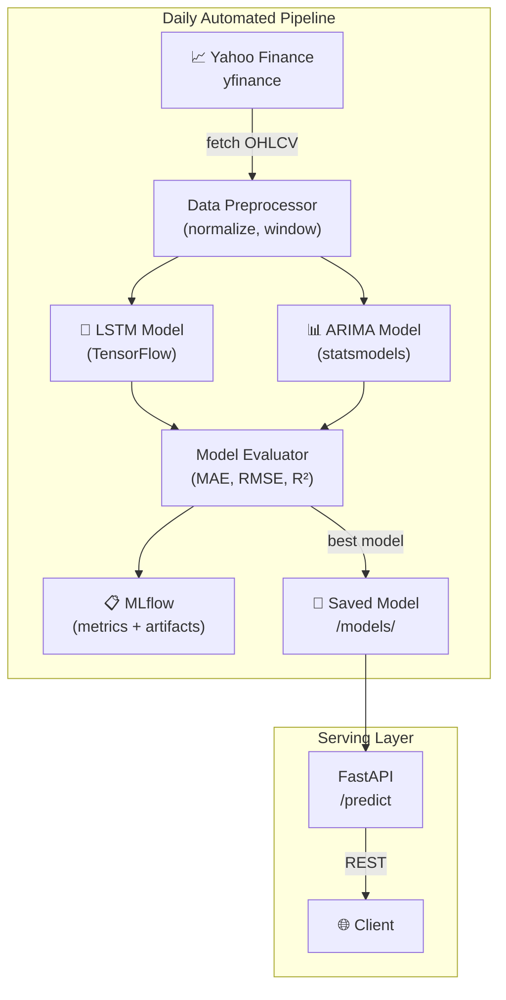

# Time Series MLOps Pipeline 📈⚙️

<p align="center">
  
  
  
  
  
  
  
  
</p>

A complete, automated **MLOps pipeline for time-series forecasting** — fetches live financial data, retrains LSTM and ARIMA models daily, evaluates performance, and serves predictions via a FastAPI endpoint. Fully containerized with Docker.

---

## ✨ Features

- **Automated pipeline** — daily fetch → train → evaluate → serve (runs at 2AM)
- **Two models** — LSTM (TensorFlow) and ARIMA (statsmodels), compared head-to-head
- **Live data** — pulls from Yahoo Finance via `yfinance`
- **FastAPI serving** — REST endpoint for real-time predictions with Swagger UI
- **MLflow tracking** — experiment metrics, model versions, artifact storage
- **Fully configurable** — all parameters via environment variables

---

## 🏗️ Pipeline Architecture



---

## 🚀 Quick Start

```bash
git clone https://github.com/ahmadalsharef994/time-series-mlops-pipeline.git
cd time-series-mlops-pipeline

# Docker (recommended)
docker-compose up --build

# Or local
pip install -r requirements.txt
python main_pipeline.py
```

API: `http://localhost:8000`
MLflow UI: `http://localhost:5000`

---

## ⚙️ Configuration

```env
DATA_SOURCE_YAHOO_TICKER=AAPL   # Stock ticker to forecast
DATA_SOURCE_YAHOO_PERIOD=7d     # History window

LSTM_EPOCHS=5
LSTM_BATCH_SIZE=32

ARIMA_ORDER=5,1,0               # (p,d,q)
```

---

## 🔮 Make a Prediction

```bash
curl -X POST http://localhost:8000/predict \
  -H "Content-Type: application/json" \
  -d '{"data": [150.2, 151.0, 149.8, 152.3, 153.1]}'
```

```json
{
  "model": "LSTM",
  "prediction": 154.2,
  "confidence_interval": [152.8, 155.6]
}
```

---

## 📁 Project Structure

```
├── api/
│   └── main.py              # FastAPI prediction endpoint
├── pipelines/
│   ├── preprocess.py        # Data fetching + normalization
│   ├── train.py             # LSTM + ARIMA training
│   └── evaluate.py          # Model comparison + logging
├── models/
│   ├── lstm/                # Saved LSTM weights
│   └── arima/               # Saved ARIMA params
├── main_pipeline.py         # Scheduler (runs daily at 2AM)
├── docker-compose.yml
└── requirements.txt
```

---

## � Live Example Output

After running the pipeline with `DATA_SOURCE_YAHOO_TICKER=AAPL`, calling `/predict` returns:

```json
{
  "ticker": "AAPL",
  "model": "LSTM",
  "predictions": [182.4, 183.1, 181.9],
  "dates": ["2024-01-16", "2024-01-17", "2024-01-18"],
  "rmse": 2.34,
  "mae": 1.87
}
```

MLflow experiment URL: `http://localhost:5000/#/experiments/1`

---

## 📊 Model Comparison

| Metric | LSTM | ARIMA | Winner |
|--------|------|-------|--------|
| Short horizon (1–3 days) | RMSE ~2.3 | RMSE ~1.9 | 🏆 ARIMA |
| Medium horizon (1–2 weeks) | RMSE ~3.1 | RMSE ~4.8 | 🏆 LSTM |
| Non-linear / volatile data | handles well | struggles | 🏆 LSTM |
| Stationary series | moderate | excellent | 🏆 ARIMA |
| Training time | minutes | seconds | 🏆 ARIMA |
| Interpretability | low | high | 🏆 ARIMA |
| Incremental retraining | supported | supported | tie |

**Rule of thumb:** Use ARIMA for short-range forecasts on stable assets; use LSTM when volatility is high or the horizon exceeds a week.

---

## 📄 License

MIT — Author: [Ahmad Alsharef](https://github.com/ahmadalsharef994)
